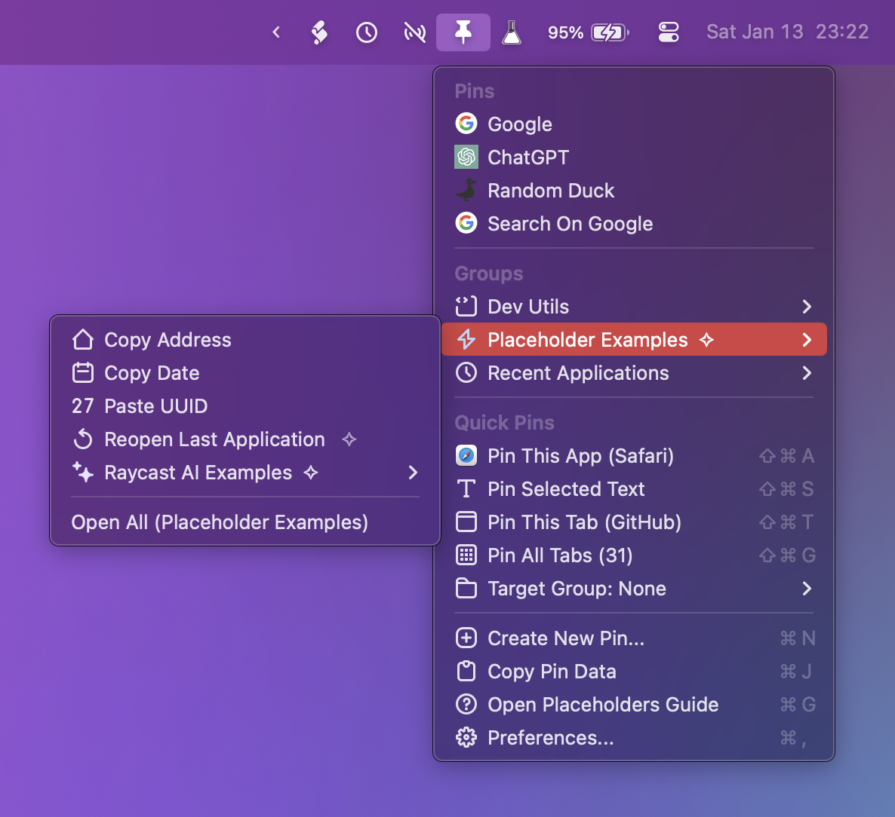

# Pins

A Raycast extension for pinning anything with a path or URL to the menu bar, with support for pinning Terminal commands and AppleScripts as well. Quickly navigate to your favorite sites, folders, and files, conveniently execute Terminal commands, and intuitively manage pins and groups from within Raycast.

## Feature Overview:

- Pin sites, files, folders, apps, Terminal commands, and scripts to your menu bar
- Pin any kind of URL, using any kind of URL scheme
- Pin current browser tab or Finder selection with a single click
- Customize pin icons
- Create groups to organize pins into
- Customize group icons
- Edit pins and groups as desired
- Move/rearrange pins and groups as desired
- View pins and groups in the menu bar or within Raycast
- Import/Export JSON data
- Highly configurable

## Commands:

- Show Pins - Initiates the menu bar extra
- View Pins - Lists all pins, allows you to edit existing or rearrange existing pins
- View Groups - Lists all groups, allows you to edit existing groups
- New Pin - Creates a new pin with a given name, URL/path, icon, and group assignment
- New Group - Creates a new group with a given name and icon
- Copy Pins - Copies a JSON representation of your pins and groups to the clipboard
- Import Data - Imports a JSON string containing pins and groups